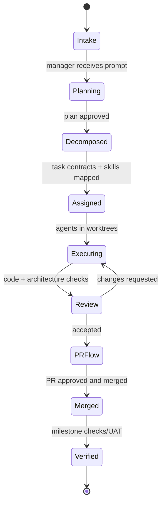
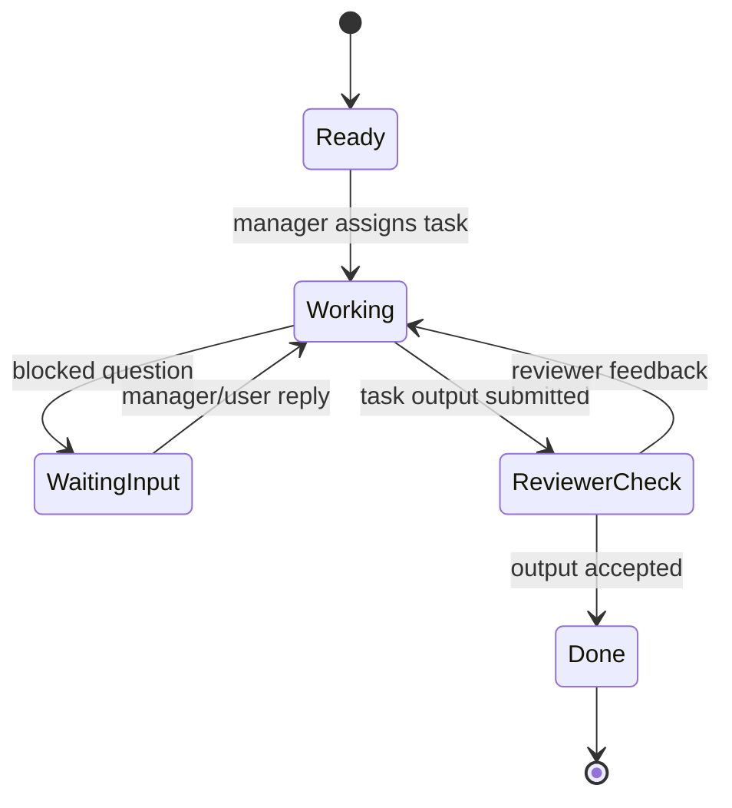
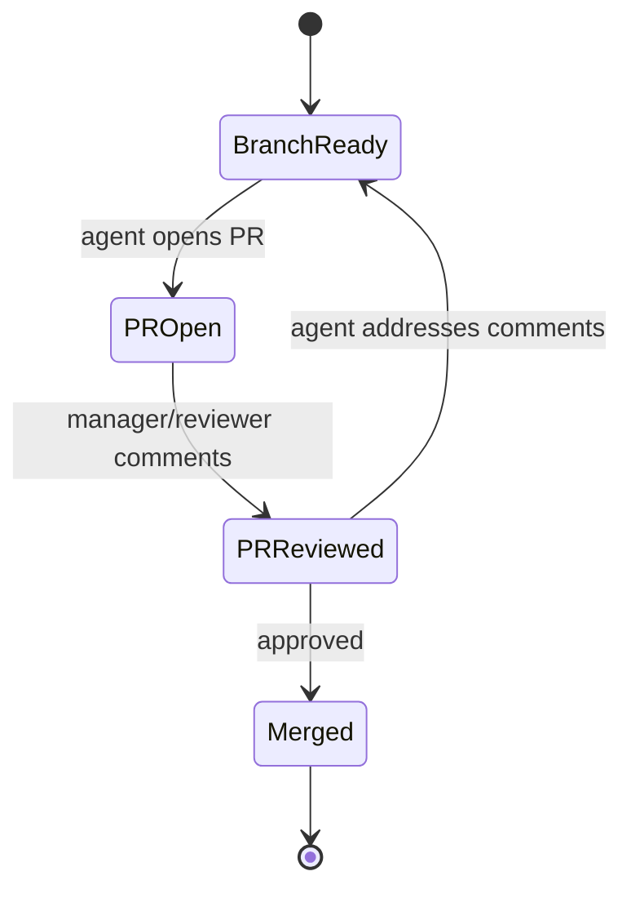

<div align="center">

```
       ✦   .    .         .        ✦
   .        .        .        .         .
         .        .      .          .
     ☁️        ✷      CLAUDE NINJA      ✷        ☁️
         .        .      .          .
   .        .        .        .         .
       ✦      .        sky above, code below     ✦
```

# Claude Ninja

Project-first, orchestrator-driven workspace for running multiple AI coding agents safely and fast.

[](https://github.com/pratham-bhatnagar/claude-ninja/stargazers)
[](https://go.dev)
[](LICENSE)
[](#)

[Features](#features) · [Installation](#installation) · [Quick Start](#quick-start) · [Usage](#usage) · [Contributing](#contributing) · [Roadmap](#roadmap) · [License](#license)

</div>

## Overview

Claude Ninja keeps every agent isolated in its own branch/worktree, routes all sub-agent output through a single Orchestrator, and provides a focused TUI to plan, execute, and verify work across projects.

- Project-first TUI: switch projects with Left/Right; browse sub-agents with Up/Down
- Orchestrator-only interaction: reply once in the Orchestrator; aggregate sub-agent output there
- Worktree isolation: each agent works on its own branch/worktree for safe concurrency
- Structured planning: Ninja plan/execute/verify via lightweight `.planning/` state
- Nudging loop: surface waiting agents to the Orchestrator to keep flow unblocked

## Features

- Multi-project navigation and global search
- Orchestrator panel with status, waiting agents, and planning commands
- Session forking and context inheritance
- Git worktree helpers for isolated branches
- Optional MCP integrations and pooling (where available)

## Installation

Prerequisites: Go 1.24+, git, tmux.

From source:

```bash
make build            # Build to ./build
make install          # Install to /usr/local/bin (sudo)
# or
make install-user     # Install to ~/.local/bin (no sudo)
```

Binary name is `claude-ninja`.

## Quick Start

```bash
# Launch the TUI
claude-ninja

# Create/import sessions per project (Orchestrator is auto-selected)
# Send a sub-agent’s output to the Orchestrator with "x"
```

## Usage

Core workflow:

- Create or import sessions per project
- Orchestrator is auto-selected per project (no manual selection)
- Switch projects with Left/Right; navigate sessions with Up/Down
- Press `x` on a sub-agent to send its output to the Orchestrator
- Use the Orchestrator to plan, execute, verify, and merge

Ninja planning commands (run from the Orchestrator):

- `/ninja:new-project` initialize goals and context
- `/ninja:plan-phase 1` draft a structured plan
- `/ninja:execute-phase 1` run sub-agents for phase 1
- `/ninja:verify-work 1` verify outputs against code

The Orchestrator panel shows your current phase (from `.planning/STATE.md`) and total phases (from `.planning/ROADMAP.md`) so you don’t have to track it manually.
Phases are simply numbered steps in the roadmap; the UI always shows which step you’re on.

Key shortcuts:

- Left/Right: switch projects
- Up/Down: navigate sessions
- `x`: send sub-agent output to Orchestrator
- `A`: from Orchestrator session, reply to all waiting agents
- `v`: cycle right pane (Orchestrator / Both / Output / Stats)
- `Ctrl+M`: jump to Orchestrator session

## State Diagrams (Vision)

These diagrams describe the target autonomous flow for Claude Ninja: manager-led planning, sub-agent execution, reviewer loops, and PR-driven integration.

### 1) Project Lifecycle



### 2) Sub-Task Agent Loop



### 3) PR Feedback Loop



## Contributing

We’d love your help! Ways to contribute:

- Triage issues and propose improvements
- Implement features from the Roadmap
- Improve docs and examples in `docs/` and `demos/`

Development setup:

```bash
make test     # Run tests
make fmt      # Format code
make lint     # Lint
```

Please read CONTRIBUTING.md before opening a PR. If proposing larger changes, open a discussion/issue first for alignment.

Security: If you discover a vulnerability, please open a private security advisory on GitHub rather than filing a public issue.

## Roadmap
- Update installers and package distribution
- Expand docs (configuration, MCP, worktrees)
- Starter templates and example projects

## License

MIT License — see LICENSE.

---

Questions or ideas? Open an issue: https://github.com/pratham-bhatnagar/claude-ninja/issues
